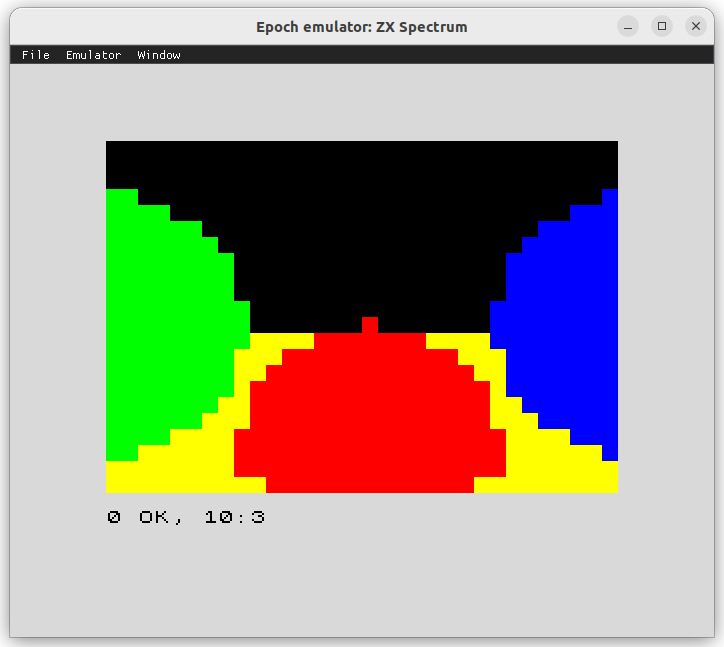
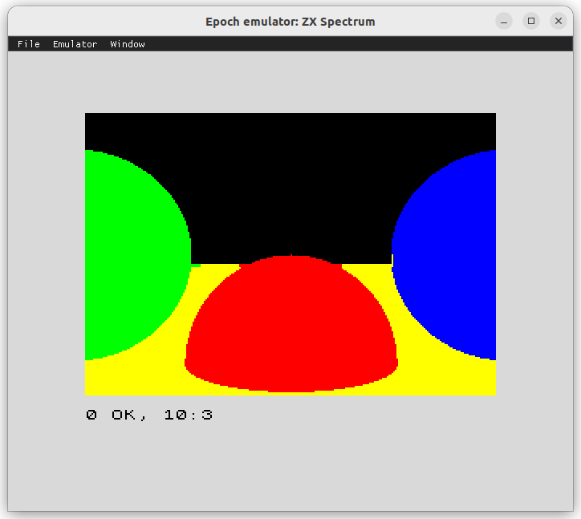

# ZX Spectrum Raytracer

This is a port of the [ZX Raytracer by Gabriel Gambetta](https://gabrielgambetta.com/zx-raytracer.html) for the [z88dk](https://z88dk.org/) C compiler.

Output of the low-res ray tracing (on the [epoch emulator](https://github.com/ghidosoft/epoch)) - 2 minutes:



Output of the hi-res ray tracing - about 20 minutes:



## Getting started

Requirements:
* make
* z88dk: https://z88dk.org/

Build the `.tap` files using make:

```bash
make
```

Example manual build command:

```bash
z88dk.zcc +zx -vn -clib=sdcc_iy -startup=31 raytracer1.c -o raytracer1 -create-app -lm
```
